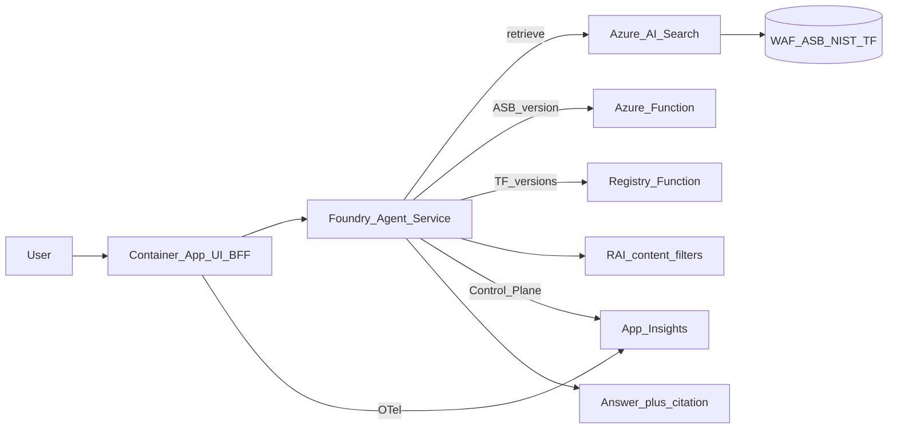

# Cloud & DevOps Standards Assistant

Answers cloud standards questions from a public corpus (WAF, Azure Security Benchmark / MCSB, NIST, Terraform docs), cites sources, and defers when outside knowledge. Built on Microsoft Foundry and Terraform in UK South.

## Azure stack

| Layer | What we use |
|---|---|
| Platform | Microsoft Foundry (`ais-csa-*` / `proj-csa-*`) |
| Model | `gpt-5-mini` + `text-embedding-3-small` |
| Retrieval | Azure AI Search (`corpus-tuned`, hybrid) |
| Agent | Foundry Agent Service |
| Tools | AI Search tool; Azure Functions (ASB version, Terraform Registry proxy) |
| App | Azure Container Apps (chat UI + BFF) |
| Secrets | Key Vault + user-assigned managed identity |
| Guardrails | Foundry RAI policy `csa-blocking-medium` + instruction guards |
| Observability | Foundry Traces / Control Plane → Application Insights; BFF OpenTelemetry |
| Evaluation | Golden set in repo + Foundry cloud Evaluations |
| IaC | Terraform (`dev` / `staging` / `prod`) |

## Architecture



Detail: [`docs/ARCHITECTURE.md`](docs/ARCHITECTURE.md).

## Repository structure

```
cloud-standards-assistant/
├── terraform/     # modules + envs
├── search/        # index, skillsets, corpus scripts
├── agents/        # agent definition + deploy/demo
├── tools/         # Functions + OpenAPI contracts
├── safety/        # RAI policy + red-team notes
├── eval/          # golden_set.jsonl + runners
├── serving/       # Container Apps UI + BFF
├── scripts/       # dev-up / dev-down
└── docs/          # architecture, deploy, cost, observability
```

## Prerequisites

- Azure subscription with Microsoft Foundry access
- `az` CLI (logged in), Terraform >= 1.7
- Budget alert on the subscription
- `terraform/envs/dev/terraform.tfvars` from the example (subscription id — not committed)

## Quick start

One-time remote state:

```bash
az account set --subscription <subscription-id>
SUBSCRIPTION_ID=<subscription-id> ./terraform/bootstrap/bootstrap-state.sh
cd terraform/envs/dev
cp terraform.tfvars.example terraform.tfvars   # set subscription_id
terraform init -backend-config=backend.hcl
```

Bring the stack up (infra + Functions + Search + agent + serving):

```bash
./scripts/dev-up.sh
# UI: terraform -chdir=terraform/envs/dev output -raw serving_url
```

Tear down:

```bash
CONFIRM_DESTROY=1 ./scripts/dev-down.sh
```

Details: [`docs/DEPLOYMENT.md`](docs/DEPLOYMENT.md). Cost notes: [`docs/INFRASTRUCTURE.md`](docs/INFRASTRUCTURE.md).

## Agent flow

1. **Retrieve** — hybrid Search on `corpus-tuned` for WAF / ASB / NIST / Terraform guidance; cite `framework` / `section` / `title`.
2. **ASB version** — Azure Function `get_asb_version` (live tool, not corpus).
3. **Terraform Registry** — dedicated Function proxies `registry.terraform.io` for provider/module versions.
4. **Multi-tool** — comparisons may call several tools in one turn.
5. **Defer** — pricing, live inventory, or no evidence: outside knowledge.

Deploy: [`agents/`](agents/), [`tools/`](tools/).


## Observability

- **UI / BFF:** each `/api/ask` returns a `trace_id`; the bubble shows tool path (e.g. `live-tool`) and a short trace prefix. BFF exports OpenTelemetry to Application Insights (`appi-csa-{env}`).
- **Foundry:** Control Plane **Traces** show duration, tokens in/out, and portal estimated cost per turn (same App Insights workspace when linked).


How to join BFF and agent spans: [`docs/OBSERVABILITY.md`](docs/OBSERVABILITY.md).

## Evaluation

**Repo / CI:** [`eval/golden_set.jsonl`](eval/golden_set.jsonl) (≥50 rows). Metrics via Foundry evaluators / chat judge: groundedness, relevance, safety. Schema gate: `eval/scripts/validate-golden-set.py` (`.github/workflows/eval.yml`). Laptop runner: `eval/scripts/run_eval.py`.

**Foundry cloud:** golden rows upload into the project; runs appear under **Evaluation** (e.g. `csa-agent-cloud-eval`). Baseline smoke (agent **v9**, run `smoke-20260910T070613Z`): overall **60%** (coherence / relevance 3/5). Runbook: [`docs/FOUNDRY-EVAL.md`](docs/FOUNDRY-EVAL.md).


Local smoke notes: [`eval/FAILURE-ANALYSIS.md`](eval/FAILURE-ANALYSIS.md).

## Cost

| Path | When | Relative cost |
|------|------|----------------|
| Function / Registry only | ASB version, azurerm versions | Lower — short tool JSON + short completion |
| Search + synthesis | Standards guidance, comparisons | Higher — retrieved chunks in context |

Instructions route version questions to live tools and guidance to Search ([`docs/COST-PER-INTERACTION.md`](docs/COST-PER-INTERACTION.md)). Use Cost Analysis or [Azure pricing](https://azure.microsoft.com/pricing/details/cognitive-services/openai-service/) for amounts. Foundry Traces show per-turn estimated cost when App Insights is linked.

Fixed cost is driven mainly by AI Search Basic. Tear down with `CONFIRM_DESTROY=1 ./scripts/dev-down.sh` when the environment is not required.

## Safety

Foundry RAI policy **`csa-blocking-medium`** (Prompt + Completion Blocking at Medium, Jailbreak) on `gpt-5-mini`, referenced from the agent `rai_config`. Instructions enforce cite-or-defer, XPIA resistance, and PII refusal. Red-team table (including a jailbreak blocked by `content_filter`): [`safety/RED-TEAM.md`](safety/RED-TEAM.md).

## Design decisions

- **Terraform Registry via Azure Function** — Foundry OpenAPI did not reliably call `registry.terraform.io` directly; a Function proxy provides a stable URL and deploy unit.
- **AI Search Basic** — largest fixed cost in `dev`; environment tear-down removes it when unused. Serving uses consumption scale (min replicas 0).
- **Tool routing** — version questions use Functions; standards guidance uses Search (see cost notes).
- **Session map in the BFF** — in-process `session_id` → Foundry `conversation_id`; not shared across replicas ([`serving/ISOLATION.md`](serving/ISOLATION.md)).
- **Trace join** — BFF `trace_id` and Foundry conversation id; W3C parent may not be shared across Foundry Control Plane and the BFF.
- **RAI** — agent `rai_config` requires the content-filter policy ARM resource id.
- **Evaluation** — repo/CI golden set plus Foundry cloud Evaluation runs; smoke baseline recorded at 60% coherence/relevance.

## Demo video

Add a short recording (multi-step ask, e.g. compare two standards or ASB version + citation) and link it here when ready.

## License

MIT — see [LICENSE](LICENSE).
