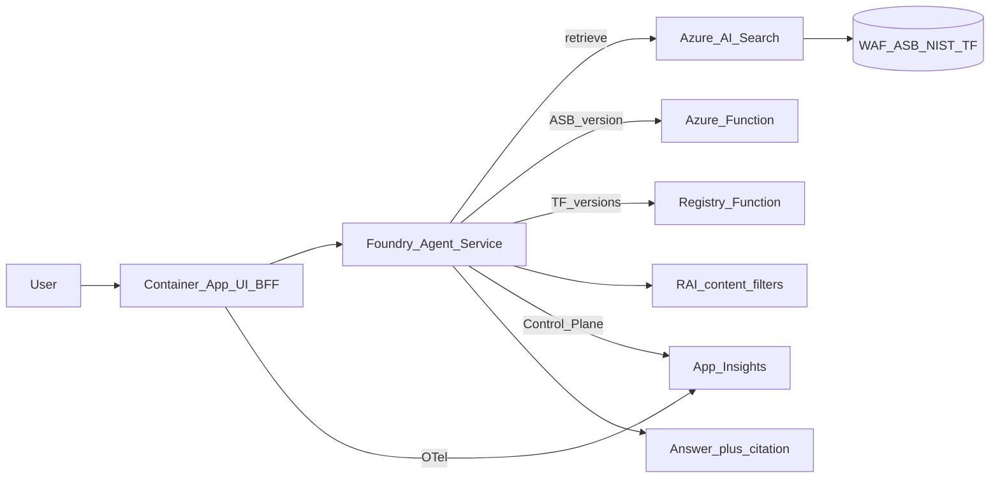

# Cloud & DevOps Standards Assistant

Agentic RAG on Azure (Foundry + Terraform, UK South): hybrid vector retrieval, multi-tool agent, Container Apps UI/BFF, OpenTelemetry / Foundry traces, RAI guardrails, and cloud + CI evaluation.

| Capability | What this repo demonstrates |
|---|---|
| RAG / vector store | Azure AI Search index (`corpus-tuned`); hybrid keyword + vector (`vectorQueries`); embeddings `text-embedding-3-small` |
| Ingestion | Blob corpus → indexer → skillsets (chunk + embed) → citation fields (`framework` / `section` / `title`) |
| Agent + tools | Foundry Agent Service (`gpt-5-mini`); Search tool; Azure Functions OpenAPI (ASB version, Terraform Registry proxy); multi-tool turns; cite-or-defer |
| Application | Chat UI + BFF on Azure Container Apps; HTTP scale (incl. toward zero); Key Vault + user-assigned MI; Entra to Foundry |
| Observability | BFF OpenTelemetry → Application Insights; Foundry Control Plane traces (latency, tokens, estimated cost) |
| Safety | Foundry RAI / content filters (`csa-blocking-medium`); jailbreak / XPIA / PII instruction guards; red-team notes |
| Evaluation | Golden set (≥50); groundedness / relevance / safety; CI schema gate; Foundry cloud Evaluations |
| Cost / ops | Tool-path routing (Function vs Search); Terraform `dev`/`staging`/`prod`; `dev-up` / `dev-down` |

Answers standards questions from a public corpus (WAF, ASB / MCSB, NIST, Terraform docs); defers outside knowledge (e.g. live pricing).

## Architecture



Detail: [`docs/ARCHITECTURE.md`](docs/ARCHITECTURE.md).

## Repository structure

```
cloud-standards-assistant/
├── terraform/     # modules + envs
├── search/        # index, skillsets, corpus scripts
├── agents/        # agent definition + deploy/demo
├── tools/         # Functions + OpenAPI contracts
├── safety/        # RAI policy + red-team notes
├── eval/          # golden_set.jsonl + runners
├── serving/       # Container Apps UI + BFF
├── scripts/       # dev-up / dev-down
└── docs/          # architecture, deploy, cost, observability
```

## Prerequisites

- Azure subscription with Microsoft Foundry access
- `az` CLI (logged in), Terraform >= 1.7
- Budget alert on the subscription
- `terraform/envs/dev/terraform.tfvars` from the example (subscription id — not committed)

## Quick start

One-time remote state:

```bash
az account set --subscription <subscription-id>
SUBSCRIPTION_ID=<subscription-id> ./terraform/bootstrap/bootstrap-state.sh
cd terraform/envs/dev
cp terraform.tfvars.example terraform.tfvars   # set subscription_id
terraform init -backend-config=backend.hcl
```

Bring the stack up (infra + Functions + Search + agent + serving):

```bash
./scripts/dev-up.sh
# UI: terraform -chdir=terraform/envs/dev output -raw serving_url
```

Tear down:

```bash
CONFIRM_DESTROY=1 ./scripts/dev-down.sh
```

Details: [`docs/DEPLOYMENT.md`](docs/DEPLOYMENT.md). Cost notes: [`docs/INFRASTRUCTURE.md`](docs/INFRASTRUCTURE.md).

## Agent flow

1. Retrieve — hybrid Search (`corpus-tuned`) for guidance; cite `framework` / `section` / `title`.
2. ASB version — Function `get_asb_version` (live, not corpus).
3. Terraform Registry — Function proxies `registry.terraform.io`.
4. Multi-tool — comparisons may call several tools in one turn.
5. Defer — pricing, live inventory, or no evidence: outside knowledge.

[`agents/`](agents/), [`tools/`](tools/).


## Observability

UI returns `trace_id` (and tool path) on `/api/ask`. Foundry Control Plane traces show latency, tokens, and estimated cost. Join BFF + agent: [`docs/OBSERVABILITY.md`](docs/OBSERVABILITY.md).


## Evaluation

Golden set + CI: [`eval/golden_set.jsonl`](eval/golden_set.jsonl), [`.github/workflows/eval.yml`](.github/workflows/eval.yml). Cloud runs: [`docs/FOUNDRY-EVAL.md`](docs/FOUNDRY-EVAL.md). Smoke baseline (agent **v9**, `smoke-20260910T070613Z`): **60%** coherence / relevance.


## Cost

| Path | Relative cost |
|------|----------------|
| Function / Registry only | Lower |
| Search + synthesis | Higher |

Detail: [`docs/COST-PER-INTERACTION.md`](docs/COST-PER-INTERACTION.md). AI Search Basic is the main fixed cost — tear down with `dev-down` when unused.

## Safety

RAI policy on the chat deployment + instruction guards. Red-team table: [`safety/RED-TEAM.md`](safety/RED-TEAM.md). Policy notes: [`safety/content-safety.md`](safety/content-safety.md).

## Design decisions

- **Registry via Function** — Foundry OpenAPI did not reliably call `registry.terraform.io` directly.
- **Session map** — BFF `session_id` → Foundry `conversation_id` in-process; not shared across replicas ([`serving/ISOLATION.md`](serving/ISOLATION.md)).
- **Trace join** — BFF and Foundry may not share one W3C parent; use `trace_id` + conversation id.
- **RAI ARM id** — agent `rai_config` needs the content-filter policy resource id (name alone is rejected).

## License

MIT — see [LICENSE](LICENSE).
