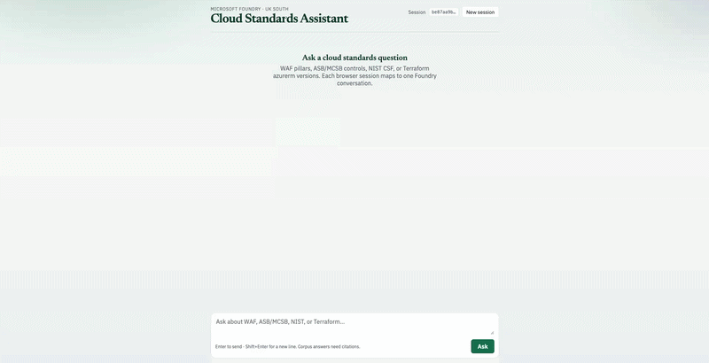
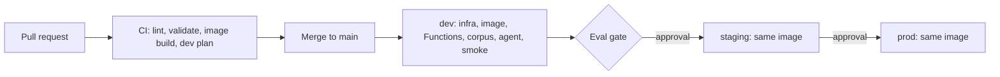

# Cloud & DevOps Standards Assistant

Cited answers to cloud-standards questions (Azure Well-Architected Framework, Azure Security Benchmark, NIST, Terraform) from an agent on Microsoft Foundry. Terraform builds the infrastructure and GitHub Actions deliver it, with no stored credentials.



*One question, three tools: Azure AI Search for ASB Key Vault guidance, the live ASB version, and the latest `azurerm` provider, with citations and a `trace_id`.*

## The problem

Platform teams answer the same standards questions every week, and the answers have to be current and traceable to a source. A general chat model answers from memory: it cannot cite the control, and it does not know this month's benchmark or provider version.

## What it does

- **Cites its sources.** Guidance comes from a public corpus indexed in Azure AI Search, and every answer names the framework, section and title.
- **Checks live facts.** The current ASB version and Terraform provider versions come from two Azure Functions, not the model.
- **Says when it doesn't know.** Pricing, live inventory and questions without evidence are deferred, not guessed.
- **Is traceable.** Every answer returns a `trace_id` that joins the UI request to the agent's tool calls in Application Insights.

## Results

Foundry cloud evaluation on the 62-question golden set, with the same `gpt-5-mini` judge for every run. Full history: [`eval/results/history.csv`](eval/results/history.csv).

| Agent version | Change | Coherence | Relevance | Response completeness |
|---|---|---|---|---|
| v15 | Baseline: `gpt-5-mini`, 50K TPM | 67.7% | 48.4% | 46.8% |
| v17 | Agent model `gpt-5.4-mini` (Foundry tool support for Search + OpenAPI) | 100.0% | 96.8% | 93.5% |

From v15 to v17, relevance rose from 48.4% to 96.8% and response completeness from 46.8% to 93.5%. Every deploy re-runs an 8-question evaluation and blocks promotion if scores drop ([`eval/thresholds.json`](eval/thresholds.json)).

## Cost

- **Idle:** AI Search Basic is the main fixed cost (roughly $75 a month). Models are pay-per-token, and the web app scales to zero.
- **Per question:** version lookups go straight to a Function. Only guidance questions pay for retrieval and the longer synthesis.
- **Off switch:** one workflow destroys an environment and purges the soft-deleted Foundry account.

## Security and responsible AI

- **No secrets in CI.** GitHub OIDC signs in to one managed identity per environment. Each identity may grant only the roles the stack needs, enforced by a role-assignment condition.
- **No keys at runtime.** The app, agent, Search indexer and Functions use managed identities and Entra ID. The one app secret lives in Key Vault.
- **Content filters as code.** The RAI policy `csa-blocking-medium` (Medium blocking on harm categories, plus Jailbreak and Protected Material) is in Terraform and attached to both model deployments and the agent.
- **Red-teamed.** All five attempts (citation bypass, prompt leak, cross-prompt injection, PII bait, violent content) were handled. See [`docs/EVIDENCE.md`](docs/EVIDENCE.md#red-team).

## How it's delivered


```mermaid
flowchart LR
  pr[Pull request] --> ci["CI: lint, validate, image build, dev plan"]
  ci --> merge[Merge to main]
  merge --> dev["dev: infra, image, Functions, corpus, agent, smoke"]
  dev --> gate{"Eval gate"}
  gate -->|approval| staging["staging: same image"]
  staging -->|approval| prod["prod: same image"]
```

The image is built once per commit and imported into staging and prod unchanged. Staging and prod wait for a reviewer.

## Run it

1. **Bootstrap once:** create remote state (`terraform/bootstrap/bootstrap-state.sh`), then apply `terraform/bootstrap/github-oidc` to create the deploy identities.
2. **Connect GitHub:** `scripts/setup-github.sh` sets up the environments, approvals, secrets and branch protection.
3. **Deploy:** merge to `main` for dev, or `make deploy ENV=dev`. Promote with the **Deploy** workflow (`target: staging` or `prod`).

Then `make demo`, `make eval` or `make smoke`. Run `make help` for the full list.

## Docs

| Doc | What's in it |
|---|---|
| [Architecture](docs/ARCHITECTURE.md) | Components, data flow, identities, environments |
| [Decisions](docs/DECISIONS.md) | Each design choice, its source, and the trade-offs |
| [Operations](docs/OPERATIONS.md) | Deploy, promote, evaluate, monitor, tear down |
| [Evidence](docs/EVIDENCE.md) | Eval runs, red team, load test, traces, cost |

## Repository

```
terraform/   modules, dev/staging/prod roots, state and OIDC bootstrap
search/      index, skillsets, indexers, corpus manifest, publish script
agents/      agent definition, instructions, deploy and demo
tools/       Azure Functions and their OpenAPI contracts
eval/        golden set, Foundry eval runner, thresholds, history
serving/     chat UI and backend on Container Apps
safety/      responsible AI notes
scripts/     tf-env.sh, setup-github.sh
.github/     CI, deploy, eval and teardown workflows
```

## License

MIT. See [LICENSE](LICENSE).
