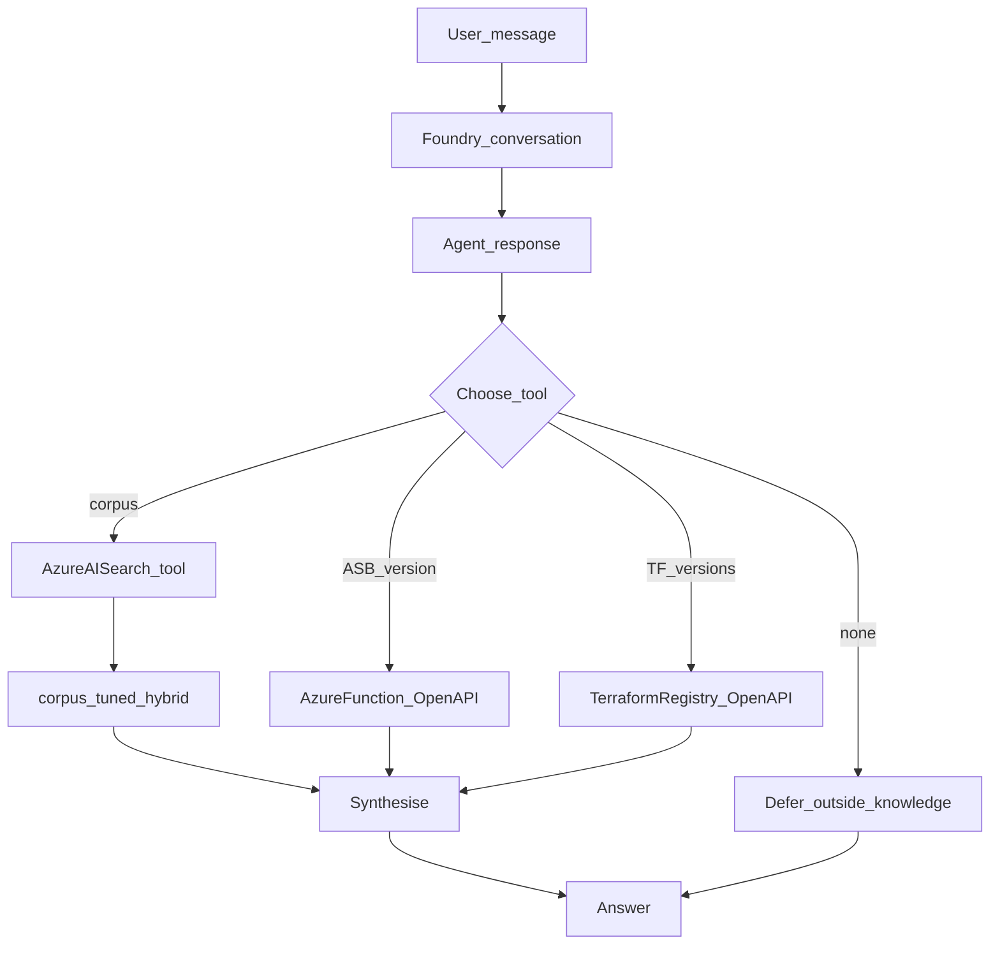

# Architecture

> This document is filled in incrementally as each phase lands. Skeleton below mirrors the README's promised sections.

## Overview

Corpus → Azure AI Search → Foundry Agent Service → Tools → Answer (with citation), with the Foundry Control Plane observing every hop and Content Safety guarding input/output.

Control Plane is the Foundry ops plane (portal + platform), not a separate compute SKU. Telemetry is OpenTelemetry-shaped and lands in Application Insights — see [`docs/OBSERVABILITY.md`](OBSERVABILITY.md).

**Content Safety** in the diagram is the Foundry account **RAI / content-filter policy** (`csa-blocking-medium`: Prompt + Completion Blocking at Medium, plus Jailbreak) attached to the chat deployment and referenced from the agent `rai_config`. Instruction-level cite-or-defer, XPIA, and PII rules live in [`agents/instructions.md`](../agents/instructions.md). Details: [`safety/content-safety.md`](../safety/content-safety.md).

## Agent flow

The agent runs on **Foundry Agent Service**. Conversation state is a Foundry **conversation**; each user turn is a **response** (OpenAI Responses API via the project client). The model may call **one or more tools** in a loop before the final message.

Decision rules (see [`agents/instructions.md`](../agents/instructions.md)):

1. **Retrieve** — Azure AI Search (`corpus-tuned`, hybrid) for WAF / ASB / NIST / Terraform **guidance** in the index.
2. **ASB version** — Azure Function `get_asb_version` for current ASB/MCSB version/revision (live tool, not the corpus).
3. **Terraform Registry** — OpenAPI tool against a **dedicated** Azure Function that proxies `registry.terraform.io` for provider/module versions.

4. **Multi-tool** — comparisons or mixed questions may call several tools in one turn.
5. **Defer** — pricing, live inventory, or no tool evidence: outside knowledge; do not invent.
6. **Failures** — see [`tools/FAILURE-HANDLING.md`](../tools/FAILURE-HANDLING.md).

Tool configs: [`tools/`](../tools/). Portal Playground uses the same agent version as `./agents/scripts/deploy-agent.sh`. Local scripts vs enterprise pipeline: [`DEPLOYMENT.md`](DEPLOYMENT.md).

## Data flow / retrieval

Corpus blobs in the private storage `corpus` container are indexed by Azure AI Search.

1. **Ingest** — Indexer reads blobs (Search system-assigned identity).
2. **Chunk** — Text Split skill (`skillset-default`: 2000/500 pages; `skillset-tuned`: 800/150 for numbered controls and nested sections).
3. **Embed** — Azure OpenAI Embedding skill calls Foundry deployment `text-embedding-3-small` (1536 dimensions) with the Search managed identity.
4. **Store** — Index projections write child chunks into `corpus-default` or `corpus-tuned` with citation fields: `framework`, `section`, `title`, `source_path`, `content`, `contentVector`.
5. **Retrieve** — Hybrid query (keyword `search` + `vectorQueries` text-to-vector via the index vectorizer). The Foundry agent uses the **Azure AI Search tool** against `corpus-tuned` (project connection `csa-ai-search`).

Public corpus sources (WAF, Azure Security Benchmark, NIST, Terraform) are fetched by [`search/scripts/fetch-corpus.sh`](../search/scripts/fetch-corpus.sh); see [INFRASTRUCTURE.md](INFRASTRUCTURE.md#corpus-sources). Foundry IQ managed grounding remains out of scope.

Details and scripts: [`search/`](../search/). Chunking comparison: [`search/CHUNKING.md`](../search/CHUNKING.md). Agent deploy: [`agents/`](../agents/).

## Environments

Three environments (`dev`, `staging`, `prod`) from the same Terraform modules, see `terraform/`.
