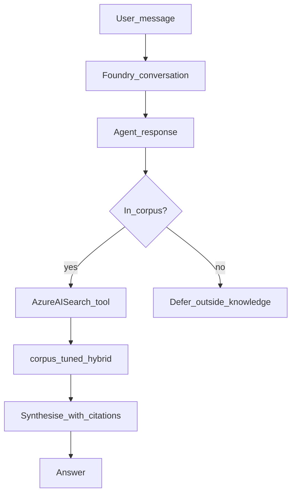

# Architecture

> This document is filled in incrementally as each phase lands. Skeleton below mirrors the README's promised sections.

## Overview

Corpus → Azure AI Search → Foundry Agent Service → Tools → Answer (with citation), with the Foundry Control Plane observing every hop and Content Safety guarding input/output.

## Agent flow

The agent runs on **Foundry Agent Service**. Conversation state is a Foundry **conversation**; each user turn is a **response** (OpenAI Responses API via the project client).

Decision rules (see [`agents/instructions.md`](../agents/instructions.md)):

1. **Retrieve** — call the Azure AI Search tool (`corpus-tuned`, hybrid) when the question may be answered from WAF, ASB/MCSB, NIST, or Terraform docs in the index.
2. **Multi-source** — for comparisons (for example ASB vs WAF on network segmentation), retrieve for each angle, then synthesise with citations.
3. **Defer** — pricing, live Azure inventory, or anything with no retrieved evidence: say it is outside knowledge; do not invent controls.
4. **Later tools** — Azure Function and MCP are Phase 4; they are not required for cite-or-defer with Search grounding.

Example: open the agent in the Foundry portal Playground and ask a multi-source corpus question (for example ASB vs WAF on network segmentation); inspect the run for Azure AI Search tool calls.

## Data flow / retrieval

Corpus blobs in the private storage `corpus` container are indexed by Azure AI Search.

1. **Ingest** — Indexer reads blobs (Search system-assigned identity).
2. **Chunk** — Text Split skill (`skillset-default`: 2000/500 pages; `skillset-tuned`: 800/150 for numbered controls and nested sections).
3. **Embed** — Azure OpenAI Embedding skill calls Foundry deployment `text-embedding-3-small` (1536 dimensions) with the Search managed identity.
4. **Store** — Index projections write child chunks into `corpus-default` or `corpus-tuned` with citation fields: `framework`, `section`, `title`, `source_path`, `content`, `contentVector`.
5. **Retrieve** — Hybrid query (keyword `search` + `vectorQueries` text-to-vector via the index vectorizer). The Foundry agent uses the **Azure AI Search tool** against `corpus-tuned` (project connection `csa-ai-search`).

Public corpus sources (WAF, Azure Security Benchmark, NIST, Terraform) are fetched by [`search/scripts/fetch-corpus.sh`](../search/scripts/fetch-corpus.sh); see [INFRASTRUCTURE.md](INFRASTRUCTURE.md#corpus-sources). Foundry IQ managed grounding remains out of scope.

Details and scripts: [`search/`](../search/). Chunking comparison: [`search/CHUNKING.md`](../search/CHUNKING.md). Agent deploy: [`agents/`](../agents/).

## Environments

Three environments (`dev`, `staging`, `prod`) from the same Terraform modules, see `terraform/`.
