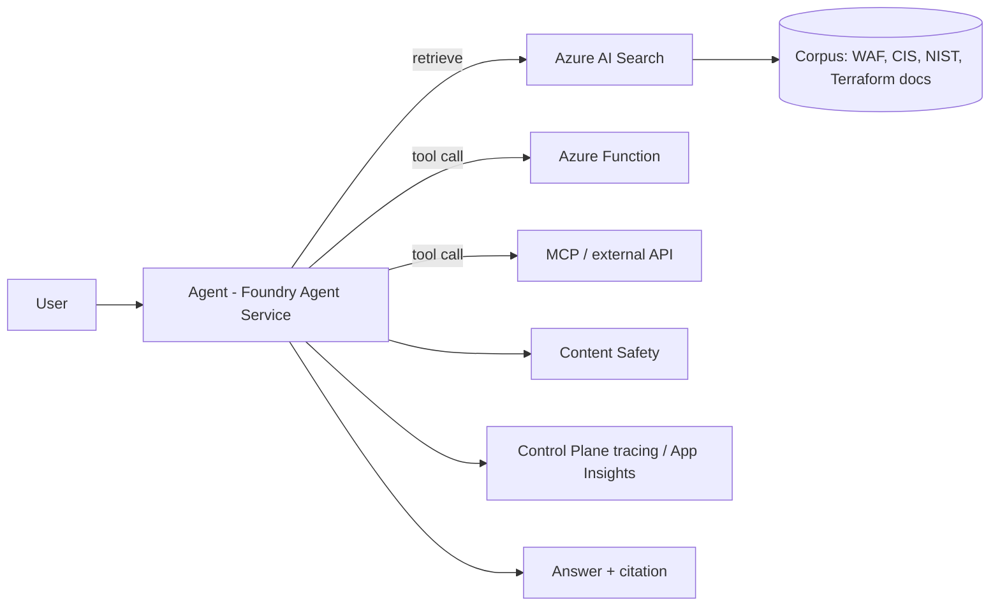

# Architecture

> This document is filled in incrementally as each phase lands. Skeleton below mirrors the README's promised sections.

## Overview

Corpus → Azure AI Search → Foundry Agent Service → Tools → Answer (with citation), with the Foundry Control Plane observing every hop and Content Safety guarding input/output.

## Agent flow

> TODO once Phase 3 lands: decision logic for retrieve vs. tool call vs. defer, with a real trace example.

## Data flow / retrieval

> TODO once Phase 2 lands: chunking strategy, embedding model, hybrid search config.

## Environments

Three environments (`dev`, `staging`, `prod`) from the same Terraform modules, see `terraform/`.

## Decisions

See [`docs/adr/`](adr) for architecture decision records, starting with [ADR-0001: Container Apps over AKS](adr/0001-compute-platform.md).
