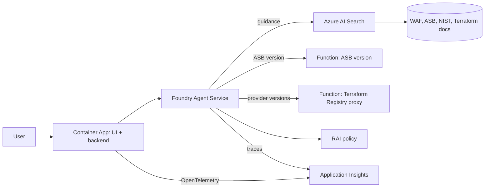

# Architecture

One agent on Microsoft Foundry, three tools, a chat app on Container Apps, all in UK South and built by Terraform.

```mermaid
flowchart LR
  User --> App[Container App: UI + backend]
  App --> Agent[Foundry Agent Service]
  Agent -->|guidance| Search[Azure AI Search]
  Agent -->|ASB version| FuncASB[Function: ASB version]
  Agent -->|provider versions| FuncReg[Function: Terraform Registry proxy]
  Search --> Corpus[(WAF, ASB, NIST, Terraform docs)]
  Agent --> RAI[RAI policy]
  App -->|OpenTelemetry| AppInsights[Application Insights]
  Agent -->|traces| AppInsights
```

## How a question is answered

Each browser session maps to a Foundry conversation, and each turn is a response. The agent may call several tools before it answers. The rules live in [`agents/instructions.md`](../agents/instructions.md):

| Question type | Tool | Why |
|---|---|---|
| Standards guidance | Azure AI Search, index `corpus-tuned` (hybrid keyword + vector) | Cited `framework` / `section` / `title` |
| Current ASB / MCSB version | Function `get_asb_version` | Live value, not corpus text |
| Terraform provider versions | Function proxying `registry.terraform.io` | Live value |
| Mixed or comparison | Several of the above in one turn | |
| Pricing, inventory, no evidence | None: defer | Never answer from memory |

If a tool fails, the agent says so and retries at most once. It never substitutes a version from training data.

## Retrieval pipeline

1. **Ingest:** public pages listed in [`search/corpus-manifest.json`](../search/corpus-manifest.json) are uploaded to the private `corpus` container with citation metadata.
2. **Chunk:** Text Split skill. `corpus-tuned` uses 800 characters with 150 overlap; `corpus-default` (2000/500) is kept as the A/B baseline.
3. **Embed:** `text-embedding-3-small` (1536 dimensions), called by the Search managed identity.
4. **Store:** chunks with `framework`, `section`, `title`, `source_path`, `content`, `contentVector`.
5. **Query:** the agent's Azure AI Search tool uses the project connection `csa-ai-search`.

Index, skillset and indexer definitions are data-plane objects with no Azure resource type, so [`search/scripts/publish.sh`](../search/scripts/publish.sh) applies them.

## Serving

One image serves the UI and the backend (FastAPI, port 8000). The HTTP scale rule allows 0 to 5 replicas at 10 concurrent requests each.

- The backend maps `session_id` to a Foundry `conversation_id` in memory. A session can only continue its own conversation. After a scale-out, a request on another replica starts a new conversation; it can never open someone else's.
- The session pepper comes from Key Vault. Foundry access uses the app's managed identity.

## Observability

| Hop | Where to find it |
|---|---|
| UI → backend | App Insights `requests`. The UI shows the `trace_id`. |
| Backend → Foundry | `dependencies` under the same operation |
| Agent model and tool calls | Foundry traces in the same App Insights (project connection `csa-appinsights`) |
| Backend ↔ agent join | `csa_session_id`, `csa_conversation_id` on the backend span |

Foundry may not continue the backend's W3C trace, so join on `trace_id` plus conversation ID. Saved queries: [`observability/queries.kql`](observability/queries.kql).

## Identities and access

| Identity | Gets | For |
|---|---|---|
| App (user-assigned) | Blob Data Contributor, Key Vault Secrets User, Cognitive Services User, Search Index Data Contributor, Search Service Contributor, AcrPull | Serving |
| Search (system) | Blob Data Reader, Cognitive Services User | Indexer and embedding skill |
| Foundry project (system) | Search Index Data Contributor, Search Service Contributor, Foundry User, Blob Data Contributor | Search tool, cloud evals, datasets |
| Foundry account (system) | Search Index Data Contributor | Search tool |
| Deployer and operators | Search Index Data Contributor, Search Service Contributor, Foundry User, Blob Data Contributor, AcrPush | Corpus publish, agent versions, evals, image push |
| GitHub deploy identity (one per environment) | Contributor plus RBAC Administrator limited to the roles above, Blob Data Contributor on state | Pipeline |

Foundry connections (Search, corpus storage, App Insights) and the RAI policy are Terraform resources. The App Insights connection key is a sensitive value and is never in code.

## Resources

Names come from each environment's `locals.tf` (workload `csa`, region `uks`, plus a random suffix where names must be globally unique).

| Resource | dev name |
|---|---|
| Resource group, VNet + Container Apps subnet | `rg-csa-dev-uks`, `vnet-csa-dev-uks` |
| Foundry account, project | `ais-csa-dev`, `proj-csa-dev` |
| Model deployments | `gpt-5.4-mini` (agent), `gpt-5-mini` (eval judge), `text-embedding-3-small` |
| Azure AI Search | `srch-csa-dev` |
| Corpus storage, Key Vault | `stcsadev<suffix>`, `kv-csa-dev-<suffix>` |
| Two Function Apps (Flex Consumption, Python 3.11) | `func-asb-csa-dev-<suffix>`, `func-reg-csa-dev-<suffix>` |
| Container Apps environment, registry, app | `cae-csa-dev`, `acrcsadev<suffix>`, `ca-csa-dev-serving` |
| Log Analytics, Application Insights | `log-csa-dev`, `appi-csa-dev` |

## Environments

| Environment | Deploys | Differences |
|---|---|---|
| dev | On every merge to `main` | Basic Search, no Key Vault purge protection |
| staging | Manual, with approval | Same topology as prod, Basic Search |
| prod | Manual, with approval | Standard Search, Key Vault purge protection |

Shared and long-lived: remote state (`rg-csa-tfstate-uks`, one container per environment, Entra auth) and the GitHub deploy identities (`rg-csa-github-uks`). Tearing down an environment never removes either.
