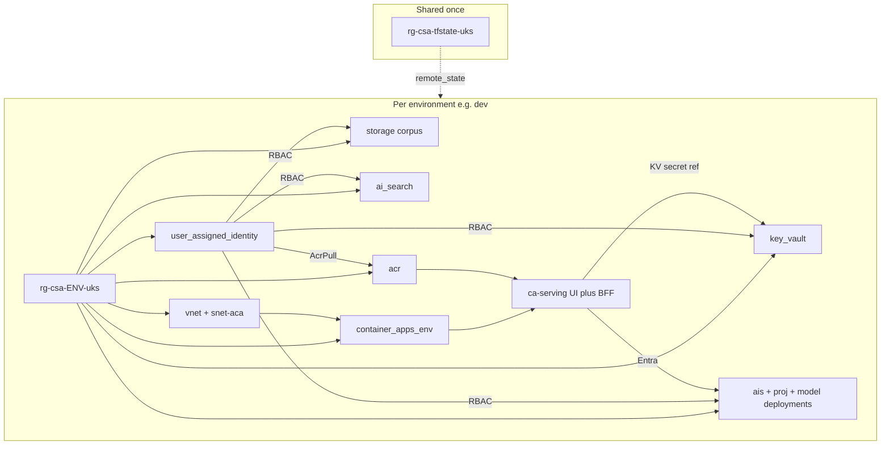

# Infrastructure

Azure resources for the Cloud & DevOps Standards Assistant, region **UK South**.

## Architecture



## Naming convention

Computed in each env’s `locals.tf` (not a naming module). Workload abbrev: `csa`. Region short: `uks`.

| Resource | Pattern | Example (dev) |
|---|---|---|
| Resource group | `rg-{workload}-{env}-{loc}` | `rg-csa-dev-uks` |
| VNet | `vnet-{workload}-{env}-{loc}` | `vnet-csa-dev-uks` |
| ACA subnet | `snet-aca-{env}` | `snet-aca-dev` |
| Storage | `st{workload}{env}{4char}` | `stcsadevab12` |
| Key Vault | `kv-{workload}-{env}-{4char}` | `kv-csa-dev-ab12` |
| AI Search | `srch-{workload}-{env}` | `srch-csa-dev` |
| AI Services | `ais-{workload}-{env}` | `ais-csa-dev` |
| Foundry project | `proj-{workload}-{env}` | `proj-csa-dev` |
| ACA environment | `cae-{workload}-{env}` | `cae-csa-dev` |
| Managed identity | `id-{workload}-{env}` | `id-csa-dev` |
| Log Analytics | `log-{workload}-{env}` | `log-csa-dev` |
| Application Insights | `appi-{workload}-{env}` | `appi-csa-dev` |
| Container Apps env | `cae-{workload}-{env}` | `cae-csa-dev` |
| Container Registry | `acr{workload}{env}{4char}` | `acrcsadevab12` |
| Serving Container App | `ca-{workload}-{env}-serving` | `ca-csa-dev-serving` |
| ASB Function App | `func-asb-{workload}-{env}-{4char}` | `func-asb-csa-dev-8wlu` |
| Registry Function App | `func-reg-{workload}-{env}-{4char}` | `func-reg-csa-dev-8wlu` |
| ASB Function plan | `asp-{workload}-{env}-asb` | `asp-csa-dev-asb` |
| Registry Function plan | `asp-{workload}-{env}-reg` | `asp-csa-dev-reg` |
| ASB Function storage | `stfasb{workload}{env}{4char}` | `stfasbcsadev8wlu` |
| Registry Function storage | `stfreg{workload}{env}{4char}` | `stfregcsadev8wlu` |

Function Apps are created with `for_each = local.function_apps` (`asb`, `reg`). Add another key to the map to get another app; names use `each.key` as the role. `asp-` = App Service plan. Storage has no hyphens (Azure rule).

Common tags: `workload`, `environment`, `region`, `managed_by=terraform`, `project=cloud-standards-assistant`.

## Resources provisioned by Terraform

- Resource group, VNet + ACA-delegated subnet
- Corpus storage account + private `corpus` container
- Key Vault (RBAC mode)
- Azure AI Search
- Microsoft Foundry (AIServices account + project)
- Model deployments: `gpt-5-mini`, `text-embedding-3-small`
- Container Apps environment + ACR + serving Container App (UI + BFF) — see [`serving/`](../serving/)
- User-assigned managed identity + RBAC to storage, KV, Foundry, Search, ACR pull
- Search system-assigned identity: Storage Blob Data Reader + Cognitive Services User (indexer + embedding skill)
- Deployer (`azurerm_client_config` object ID): Search Index Data Contributor (query index documents); ACR Push
- Foundry project system-assigned identity: Search Index Data Contributor (agent Azure AI Search tool)
- Foundry account system-assigned identity: Search Index Data Contributor (agent Azure AI Search tool)
- Azure Function App (Flex Consumption FC1) for ASB version tool — see [`tools/`](../tools/)
- Second Azure Function App (Flex Consumption FC1) for Terraform Registry proxy — see [`tools/`](../tools/); local vs pipeline deploy map in [`DEPLOYMENT.md`](DEPLOYMENT.md)
- Key Vault secret `serving-session-pepper` referenced by the serving Container App (KV proof; Foundry uses Entra)

Index, skillset, and indexer definitions live in [`search/`](../search/) (deployed with scripts, not Terraform).

## Corpus sources

All four sources are public and auto-fetched by [`search/scripts/fetch-corpus.sh`](../search/scripts/fetch-corpus.sh) from URLs in [`search/corpus-manifest.json`](../search/corpus-manifest.json):

- Azure Well-Architected Framework
- Azure Security Benchmark (CC BY on Microsoft Learn)
- NIST Cybersecurity Framework / NIST 800-53
- HashiCorp Terraform best-practice docs

No gated PDFs and no manual download step. Fill eval `ground_truth` for `PLACEHOLDER` rows only from ingested, cited chunks — never from memory.

## Remote state

Bootstrap once (pass your subscription via env var — do not commit IDs):

```bash
SUBSCRIPTION_ID=<subscription-id> ./terraform/bootstrap/bootstrap-state.sh
```

| Item | Value |
|---|---|
| Resource group | `rg-csa-tfstate-uks` |
| Storage account | `stcsatfstateuks` |
| Containers | `tfstate-dev`, `tfstate-staging`, `tfstate-prod` |
| State keys | `csa-{env}.tfstate` |

## Environments

| Environment | Purpose | Notes |
|---|---|---|
| dev | Iteration | Basic Search, no KV purge protection; tear down when unused |
| staging | Pre-prod | Same topology as prod at Basic Search — Terraform ready, not applied |
| prod | Production-shaped | Standard Search, KV purge protection — Terraform ready, not applied |

## Cost estimate (idle `dev`, rough)

Target: low double-digit USD/month if left mostly idle.

| Resource | Rough monthly (idle) |
|---|---|
| AI Search Basic | ~$75 (largest fixed cost) |
| AI Services / model deployments | Pay-per-token; near $0 when idle (watch TPM quota) |
| Storage + Key Vault | <$5 |
| Log Analytics | <$5 at low ingest |
| Container Apps env | Low / consumption when no apps |
| ACR Basic | ~$5 |
| Serving Container App | Pay per vCPU-s / GiB-s when replicas > 0 |
| VNet | Negligible |

**Budget alert:** set on the subscription before first apply (example threshold £50/month).

```bash
CONFIRM_DESTROY=1 ./scripts/dev-down.sh
```

Default path deletes the env resource group, then clears Terraform state. `MODE=terraform` runs `terraform destroy` only. Recreate with `./scripts/dev-up.sh` ([`DEPLOYMENT.md`](DEPLOYMENT.md)).

## Foundry check

After `dev` apply, confirm the Foundry project and model deployments in the portal.

## Apply order

1. `az account set --subscription <subscription-id>`
2. `SUBSCRIPTION_ID=<subscription-id> ./terraform/bootstrap/bootstrap-state.sh`
3. Budget alert in Cost Management
4. `cd terraform/envs/dev && cp terraform.tfvars.example terraform.tfvars` — fill in `subscription_id`
5. `terraform init -backend-config=backend.hcl && terraform plan && terraform apply`

Terraform dependency order inside apply: RG → (network, storage, KV, search, foundry, identity in parallel where safe) → ACA env (needs subnet + LAW) → RBAC assignments → model deployments.

## Teardown

```bash
CONFIRM_DESTROY=1 ./scripts/dev-down.sh
```

Remote state (`rg-csa-tfstate-uks`) is retained.
