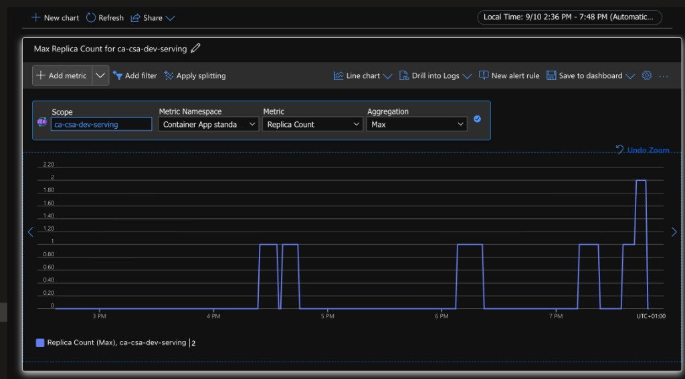

# Concurrent load evidence (AZP-4)

## Portal screenshot



Portal: **Container App** `ca-csa-dev-serving` → **Monitoring** → **Metrics** → **Replica Count** (Max). Chart shows scale-to-zero / wake to 1, then a peak of **2** under concurrent load (~19:40–19:50 local).

## Script output (2026-09-10)

```
Date: 2026-09-10 (UTC evening run)
Serving URL: https://ca-csa-dev-serving.yellowwave-cfbff046.uksouth.azurecontainerapps.io
Concurrency / requests: 40 / 200 GET /health
ok / err: 200 / 0 (wall ~1.5s, p95 ~0.47s)
Replica count before: 1
Replica count after: 2
Scale rule: http-concurrency, concurrentRequests=10, maxReplicas=5
```

Also in [`evidence/`](evidence/): `replica-count.png` (portal) and optional `load-concurrent-*.log`.

Replica names observed:

- before: `…-fw27z` (1)
- after: `…-fw27z`, `…-jbqgc` (2)

## Caption

> Concurrent `/health` load against `ca-csa-dev-serving` on `cae-csa-dev` (200 requests, concurrency 40). HTTP scale rule `http-concurrency` (10 concurrent requests, maxReplicas 5). Portal Metrics **Replica Count (Max)** and `az containerapp replica list` both show scale-out to **2**. BFF remains a thin Foundry client with per-session conversations (see `ISOLATION.md`).
